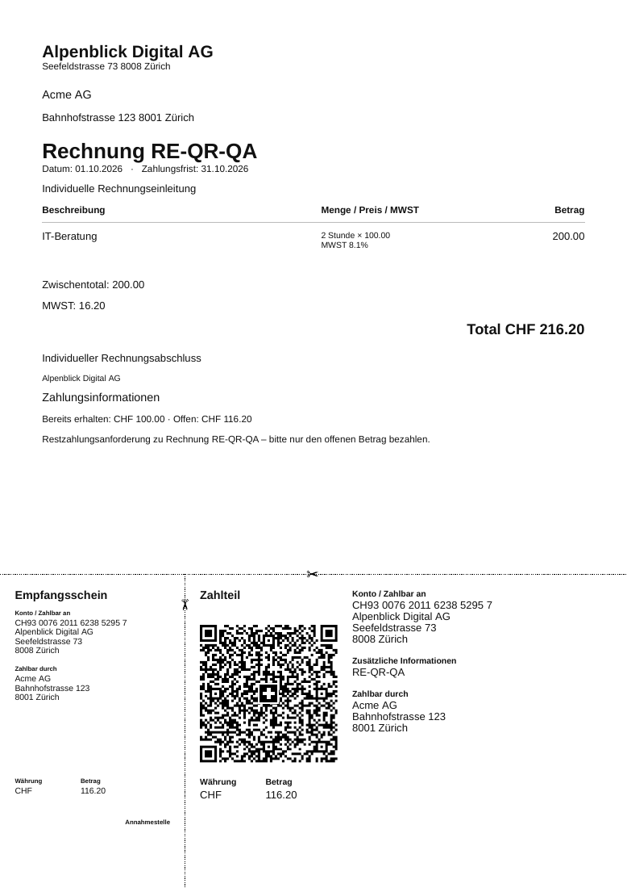
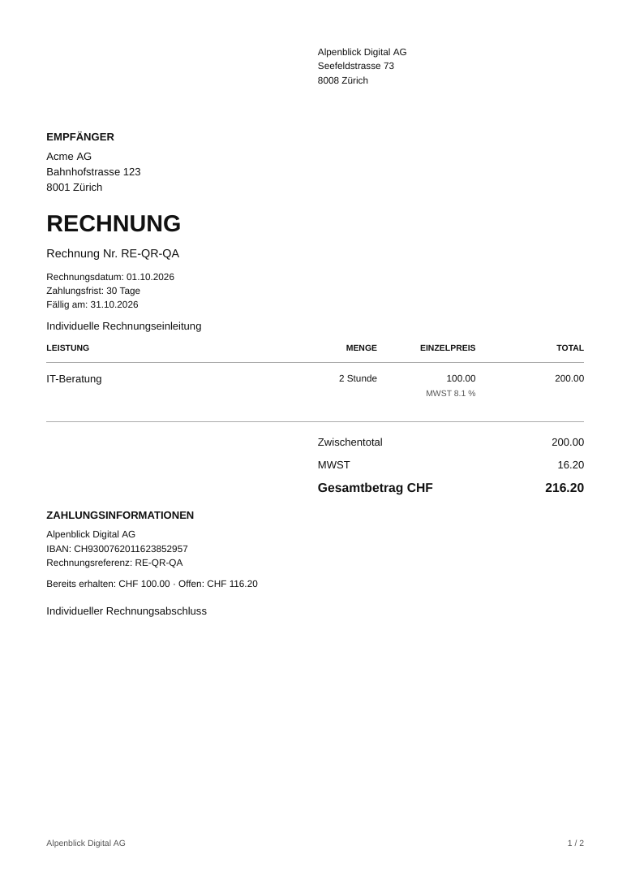
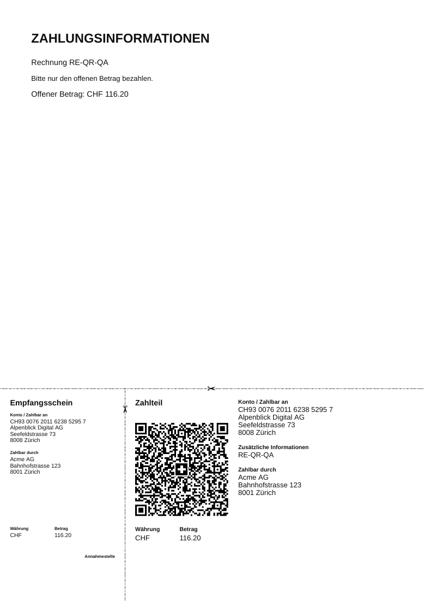

# Binso One: PDF, Schweizer QR-Rechnung und App-Start – Audit 09.10.2026

## Arbeitsstand und Umfang

Ausgangsstand war `91106bec600503d8d51e01eaa9dbe34967bef195` auf main. Während der Arbeit wurde PR #226 (Avatar-Layout) integriert; diese Änderungen sind durch Rebase auf `87fcfc2f` erhalten. Arbeitsbranch: `fix/pdf-loading-standard-20261009`. PR #222 und #214 wurden nicht verändert. Die erste Implementierung ist Commit `3286807e`; Folgecommits und der abschliessende PR-Head sind in der Branch-Historie nachvollziehbar. Kein Merge, keine Azure-Auslieferung und keine Änderung produktiver Daten wurden ausgeführt.

Die im Auftrag genannten neuen Screenshots und nicht im Repository enthaltene frühere Freigaben standen hier nicht als Dateien zur Verfügung. Referenz waren der aktuelle Code, dessen UX-Verträge und echte Renderings. Eine vollständige externe Freigabehistorie kann dadurch nicht bestätigt werden.

## Nachgewiesene Ursachen und Korrekturen

| Aktuelles Verhalten am Ausgangsstand | Route | Verantwortlich | Nachgewiesene Ursache | Korrektur | Entfernte Altlast | Regression |
|---|---|---|---|---|---|---|
| Kompakter Beleg ohne vollständige Geschäftsdokumenthierarchie | PDF-Vorschau, Download, Versand | document-pdf.ts | Ein monolithischer Renderer ordnete Empfänger, Positionen und Texte ohne gemeinsame Präsentationsauflösung an | Gemeinsame Präsentationsdaten, Firmenkopf, Empfänger, Metadaten, Tabelle, Zusammenfassung, Zahlung, Abschluss und Footer | Alte kompakte Darstellung | Echte PDF-Text-, Seiten- und Bildprüfungen |
| QR erscheint auf Inhaltsseite oder fehlt; Vorschau zeigt reale einzelne Seite | Rechnungs-PDF | document-pdf.ts, qr-bill.ts | QR wurde abhängig vom verbleibenden Platz angefügt; Zahlungsstatus und Validität steuern die tatsächliche Seitenzahl | Separate letzte A4-Seite ausschliesslich bei gültiger zahlbarer Rechnung | Inline-QR-Platzierung | QR-Raster tatsächlich decodiert, Statusmatrix |
| Firmenvorlagen werden nicht zuverlässig verwendet; spätere Einstellungen ändern historische Darstellung | Rechnungen/Angebote, Dokumenteinstellungen | Renderer, Dokumenttabellen | Bereits vorhandene Snapshot-Felder wurden nicht konsequent gefüllt/aufgelöst | Migration 0045, dokumentbezogene Text-Snapshots bei Erstellung; Aussteller/Kunde/Zahlung bei Ausgabe; danach unveränderlich | Live-Fallback als Normalfall für neue historische Dokumente | SQL-Trigger, Backfill-Erhalt, spätere Vorlagenänderung |
| Logo fehlt im Server-PDF | Drei PDF-Endpunkte | document-logo.ts | Renderer hatte keinen zentralen autorisierten Asset-Bezug | Mandantenbezogener company_logo-Zugriff, validiertes Format/Grösse, PNG-Normalisierung | Kein paralleler Logo-Fetch | Tenant-Isolation, WebP, eingebettetes PDF-Bild |
| Neue PDF-Datei kann kurz alte Seite/Seitenzahl zeigen | Dokumentmodal | pdf-preview.tsx | Ladezustand war nicht an die konkrete Datei gebunden | Dateibezogener Lade-/Fehlerzustand und Seitenreset pro PDF | Ungebundener Viewer-Zustand | Zwei echte Seiten, Mobile/Desktop-Navigation |
| Kleine schwarze Linie vor Logo, anschliessend zusätzlicher Splash | Alle App-Routen | app/loading.tsx, AppShell | Route-Fallback, Session-Stripe und zusätzlicher zeitgesteuerter Launch waren unabhängig | Ein gemeinsamer AppStart während notwendiger Sessionprüfung; lokale RouteLoading innerhalb Shell | Session-Stripe, showLaunch, 900-ms-Timer, launch.seen | Gemessene sichtbare Phasen, langsame/fehlerhafte Session |
| Shell und Navigation werden bei Seitenwechsel neu montiert | Kunden, Produkte, Details usw. | Route-AppShell | Jede Seite besass ihren eigenen Frame | Persistenter Root-Host; Seiten registrieren Titel/Aktionen im Kontext | Frame pro Route | Identische DOM-Knoten vor/nach Navigation, null frische Auth-Abfragen |
| Hydration-Abweichung mit warmer Session oder Teameinstellungen | App-Start, Einstellungen/Team | AppShell, team-settings.tsx | Browsercache beziehungsweise Browser-Modus beeinflussten den ersten Render anders als SSR | Deterministischer initialer Sessionzustand, bestehender useBackendMode-Hook | Cache-Lesezugriff beim initialen Render; direkter Render-Moduscheck | Refresh/Navigation, Browser-Runtime-Fehlerprüfung |
| App-Metadaten/PWA-Startkonfiguration greifen nicht | Tatsächliche 16 App-Sektionen | verwaister customer-app-Layout, Root-Manifest | Layout hatte keine Kindrouten; file-based Root-Manifest übersteuerte Kind-Metadaten | Gemeinsame Metadaten an tatsächliche Sektionen gebunden; expliziter Manifest-Endpunkt | Verwaister Route-Group-Layout, Root manifest.ts | Ausgelieferter Manifest-Link /manifest-app.webmanifest |
| Erstes SW-Control kann weiteren Reload auslösen | PWA-Start/Update | pwa-register.tsx, sw.js | Jeder controllerchange löste Reload aus; automatische Aktivierung | Erstübernahme ohne Reload; Aktivierung wartender Updates ausdrücklich, einmaliger Reload | Automatisches skipWaiting/reload | Lifecycle-Tests Erstinstallation, Update, mehrfaches Event |
| Konkurrierende Loader-CSS und Responsive-Verhalten | App/Demo | app.css, marketing.css, responsive.css | Unterschiedliche Logo-Aufbau-, Ring-, Stripe-Animationen und mobile Ausblendung | Originalicon 72 px mobil/80 px Desktop, dezenter Pulse, Dark/Reduced Motion | app-logo-build, app-launch-out, launch-pulse, session-loading, alte mobile Ausblendung | CSS-Architektur, zwei Themes, reduced motion |

## Fachliche Dokumentlogik

Die bestehenden invoice_intro_text/invoice_footer_text und quote_intro_text/quote_footer_text bleiben die einzige Firmenkonfiguration. Neue Dokumente erhalten einen Snapshot. Ein individueller Dokumenttext (`note`, beziehungsweise vorhandener Legacy-Einleitungstext) ersetzt die Einleitung; er wird nicht zusätzlich dupliziert. Zurücksetzen verwendet den gespeicherten Standard. Der Abschluss kommt aus dem Snapshot. Ein bearbeiteter vorhandener Entwurf übermittelt seine Nummer; der Server löst den richtigen gespeicherten Snapshot nach Tenant, Art und Entwurfsstatus auf.

Bereits ausgegebene Dokumente behalten Aussteller, Kunde, Zahlungsinformationen und Text. Legacy-Dokumente ohne Snapshot werden einmal mit den zum Migrationszeitpunkt vorhandenen Einstellungen versehen und mit `legacy-current-settings` gekennzeichnet. Tatsächlich frühere, nirgends gespeicherte Vorlagentexte lassen sich nicht rekonstruieren. Der Migrationstest vergleicht alle anderen Dokumentfelder vor/nach dem Backfill; Summen, Status, IDs und Zeitstempel bleiben erhalten.

Positionen und Summen stammen aus der bestehenden Geschäftslogik (`line_total`, subtotal, vat, total, openAmount). Der Renderer berechnet keine neue Finanzlogik. Fehlende optionale Firmenangaben und Logos werden ausgelassen. Logos stammen ausschliesslich aus autorisierten Unternehmensdateien, niemals aus beliebigen externen URLs. Vorschau, Download und Versand benutzen denselben Renderer. Der Viewer lädt und exportiert denselben Blob; es gibt keine künstliche Seitenzahl.

## Layoutvergleich und QR-Nachweis

Gleicher synthetischer Beleg: CHF 216.20, davon CHF 100.00 bezahlt, offen CHF 116.20, identische Unternehmens- und Kundendaten.

| Vorher | Nachher: Rechnung | Nachher: QR-Seite |
|---|---|---|
|  |  |  |

[PDF vorher](evidence/pdf-loading-20261009/pdf-before.pdf) · [PDF nachher](evidence/pdf-loading-20261009/pdf-after.pdf)

SwissQRBill erzeugt den Empfangsschein/Zahlteil mit seiner normierten Geometrie. Der Renderer legt eine separate letzte A4-Seite an. Bei mehrseitigem Inhalt entstehen zusätzliche Inhaltsseiten vor dieser Seite. Zulässige Zeichensätze, strukturierte Adressen, IBAN/QR-IBAN und Referenz werden validiert. EUR verwendet eine gewöhnliche IBAN, CHF kann QR-IBAN mit QRR verwenden. Ungültige Daten erzeugen keine zahlbare QR-Seite und einen nachvollziehbaren Hinweis. Die Ausstellung prüft auch die Debitoradresse.

Die echten PDF-Seiten wurden rasterisiert und mit ZXing decodiert: offene Rechnung Seite 2 `SPC/0200`, CHF **216.20**; teilweise bezahlt Seite 2 CHF **116.20**; strukturierter Aussteller und Debitor stimmen. Entwurf, bezahlt, storniert und versendetes Angebot enthalten keinen zahlbaren QR-Code. Rohbeweis: [qr-decoded.json](evidence/pdf-loading-20261009/qr-decoded.json). Dies ersetzt keine bankseitige Zertifizierung.

Getestet wurden Angebote Entwurf/versendet; Rechnungen Entwurf/offen/teilbezahlt/bezahlt/storniert; mehrere und lange Positionen; mehrseitiger Inhalt; gültige/ungültige Zahlungsdaten; individuelle Standardtexte und historische Snapshots; fehlendes/geladenes Logo; reale Seitenanzahl und Beträge. [PDF-Matrix](evidence/pdf-loading-20261009/pdf-matrix.json).

Offene Rechnungen erhalten den Restbetrag; vollständig bezahlte, stornierte, Entwürfe und Angebote keine erneute Zahlungsaufforderung. Stornierung wird ausdrücklich gekennzeichnet. Der kompakte Einzelseitenviewer mit Vor/Zurück, vollständigem A4-Fit und internem Zoom bleibt erhalten.

## Ladephasen und Messung

| Phase | Bedingung / notwendige Arbeit | Dauer / Anschluss |
|---|---|---|
| Früher Route-Fallback | Next-Streaming bevor Route bereit | Unabhängig von Session und Splash, zusätzliche leere Darstellung möglich |
| Früher Session-Stripe | Session-/Tenant-/Berechtigungsprüfung | Bis Sessionantwort; anschliessend noch Launch-Overlay möglich |
| Früher Launch | Zeitgesteuerter Client-Effekt nach Montage | Künstliche 900 ms; bei neuer Route erneut montiert |
| Jetzt AppStart | Echter Start/Refresh bis notwendige Sessionprüfung fertig | Keine Mindestdauer; Seiten-Hooks initialisieren parallel, Inhalt bleibt hidden |
| Jetzt lokale RouteLoading | Neue Route innerhalb bereits freigegebener Shell | Nur Inhaltsbereich; Navigation/Frame bleiben montiert |
| Jetzt Fehler/Zugriff | Session fehlgeschlagen, abgelaufen oder unberechtigt | Verständlicher Zustand/Retry, keine kurz sichtbaren geschützten Inhalte |
| PWA-Übernahme/Update | Erster SW-Controller oder akzeptiertes Update | Erste Übernahme kein Reload; bestätigtes Update einmaliger Reload |

WebKit, Produktionsbuild, synthetische autorisierte API-Fixtures; Auth 350 ms, Daten 150 ms, langsame Auth 1200 ms. Je Szenario ein Lauf, kein statistischer Benchmark und keine Azure-Messung. `firstMeaningfulMs` misst erstmals sichtbaren nutzbaren Inhalt nach vollständigen Startoverlays, nicht nur ein bereits versteckt gerendertes DOM. Dark-Läufe verwenden reduzierte Animationen.

| Szenario | Hell vorher → nachher (ms) | Dunkel/reduced vorher → nachher (ms) |
|---|---:|---:|
| Kaltstart | 1166 → 636 | 618 → 659 |
| Browser-Refresh | 508 → 498 | 468 → 448 |
| Neuöffnung im bestehenden Browserkontext | 1154 → 674 | 619 → 579 |
| Refresh mit langsamer Session | 1349 → 1325 | 1356 → 1298 |
| Interne Navigation (Route fertig) | 337 → 839 | 317 → 327 |

Die Rohdaten zeigen keine allgemeine Beschleunigung jedes Szenarios. Nachgewiesen sind die beseitigte Loader-Kaskade, entfernte künstliche Wartezeit, parallelisierte initiale Arbeit und erhaltene Shell. Der hell gemessene Routenwechsel ist langsamer; die Ursache dieses einzelnen Laufzeitunterschieds ist nicht abschliessend isoliert. Auth-Abfragen: je Start/Refresh eine, bei warmem Routenwechsel null, vorher wie nachher. Wiederholte Profilabfragen (zwei pro Start) bleiben als offen dokumentierte Optimierung; sie wurden nicht als beseitigt behauptet. [Vorher-Rohwerte](evidence/pdf-loading-20261009/loading-before.json) · [Nachher-Rohwerte](evidence/pdf-loading-20261009/loading-after.json).

Zusätzlich: Rücknavigation, Detail/Übersicht, bestehende/abgelaufene Sitzung, Initialisierungsfehler mit Retry, Hell/Dunkel und Reduced Motion. Die Neuöffnung emuliert PWA-Neustart im selben Kontext, ist kein physischer iOS-/Android-Standalone-Test. Service Worker cached weiterhin keine geschützten APIs/Sessionantworten. Die begrenzte Sessioncache-Gültigkeit und notwendige Sicherheitschecks bleiben erhalten.

## Bottom-Navigation und kontrollierte Bereinigung

Das bestehende JSX der Bottom-Navigation und sämtliche zugehörigen CSS-Deklarationen einschliesslich Responsive-Kontext sind unverändert. Der Vertrag prüft SHA-256 `aa85bddbeda0c9cb3349f3592857675a6cab219ac95f462eee250927bad8dfd1`. Browserprüfungen weisen zusätzlich denselben Shell- und Navigations-DOM-Knoten vor/nach interner Navigation nach. Es wurden keine Bottom-Navigation-Styles oder Funktionen geändert.

Alte Loader-Selektoren und Komponentenpfade wurden nach Referenzsuche entfernt. Neue Regeln stehen an ihren zentralen Stellen; bestehende Media-Query-Blöcke werden verwendet, keine angehängten konkurrierenden Overrides. CSS-Prüfung: 451 verwendete Klassen, sechs registrierte Runtime-Klassen, 14 Media-Blöcke. Der Header-/Avatar-Fix aus PR #226 bleibt integriert.

## Teststrategie und Freigabegrenzen

FAST: gezielte ESLint-/Session-/PDF-/Migrationstests, PDF-Raster und visuelle Inspektion. INTEGRATION: vollständige Unit-/RLS-/Migrationstests, Typecheck, Produktionsbuild, Navigation-Vertrag, CSS-Architektur, Route-CSS, Dokument-/Header-Browserprüfungen und Startup-/SW-Lifecycle-Tests. RELEASE: die vorhandenen Quality-Gates bleiben aktiv; Loading-Browserprüfung wurde in beide CI-Browser aufgenommen. Keine Gates deaktiviert oder umgangen. Produktionsabhängigkeitsaudit ohne bekannte Schwachstellen; vollständiger Audit respektiert ausschliesslich die schon dokumentierte Dev-Ausnahme GHSA-VFJ7-8CJW-P6XM.

Lokales Chromium konnte wegen wiederholt unvollständiger Browserdownloads nicht installiert werden. WebKit wurde lokal verwendet; Chromium muss im PR-CI erfolgreich laufen. Azure-Deploymentcheck, Live-Smoke, echte produktive Session/Netzwerk-Latenzen, Bank-Scan und physische installierte PWA sind vor tatsächlicher Releasefreigabe noch erforderlich. Bereits mit falschem Manifest installierte PWAs benötigen möglicherweise Manifest-Aktualisierung oder Neuinstallation durch das Betriebssystem. Historische Inhalte ohne gespeicherte Vergangenheit bleiben eine nachvollziehbar gekennzeichnete Grenze.

Vor Merge nach main ist die ausdrückliche Freigabe des Auftraggebers erforderlich. Deployment erfolgt erst nach weiteren erforderlichen Freigaben und muss den tatsächlich ausgelieferten Commit nachweisen.
