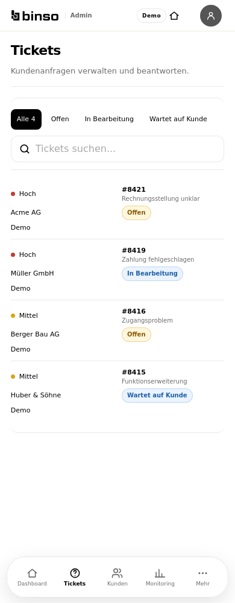

# Binso One V21.1 – Ursachen, Umsetzung und Nachweise

## Ausgangsstand und Schutzgrenzen

Aktueller geprüfter main: `1eef9fb1d005d4752f12a9dd5c0e620decca4444`, PR #227 integriert. Arbeitsbranch `refactor/v21-1-central-ui-foundation-20261009`. Offene PRs #222 (älterer UX-Stand) und #214 (Security) bleiben unangetastet. Die zuletzt integrierten UX-Pakete #220/#221/#223/#224/#225/#226/#227 wurden berücksichtigt. Zum erneuten GitHub-Abgleich waren main und die erfolgreichen Quality-/Azure-Läufe unverändert. Keine produktiven Daten, API-Routen, Datenbankschemata oder Finanzberechnungen werden in V21.1 verändert. Kein Merge und kein Deployment dieses Pakets.

Die drei vorhandenen Original-Designboards „Binso UI-Storyboard auf Deutsch“, „Binso UI-Designsystem und App-Übersicht“ und „Binso App UX/UI-Designboard fürs Schweizer Business“ wurden visuell verglichen. Neuere explizite Vorgaben, die freigegebenen Repository-Verträge und die aktuelle Bottom-Navigation haben Vorrang vor älteren Board-Details (etwa Farben/Preisen/Navigation). Es wird keine vollständige externe Freigabehistorie behauptet.

## Vollständiges statisches Inventar

71 Page-Dateien, 13 Operator-Laufzeitvarianten, 96 HTTP-Routen und 163 JSX-Komponentendeklarationen sind erfasst. [Routenmatrix](architecture/ui-foundation-acceptance.md), [Komponentenmatrix](architecture/ui-foundation-components.md), [CSS-Konfliktmatrix](architecture/ui-foundation-css-conflicts.md), [vollständiger maschinenlesbarer Katalog](architecture/ux-inventory.json). Der Katalog enthält Importpfade, Layouts, Props, Bedingungen, Klassen, CSS-Quellen und Media-Kontexte. Inaktive Layout-Zweige werden vom seitenbezogenen Graph getrennt; ein statischer Kandidat ist kein Nachweis tatsächlich gerenderter Darstellung.

2'472 CSS-Regeln, 432 wiederholte Selektor-/Kontext-Kandidaten, 322 Kandidaten mit unterschiedlichen Property-Werten und null `!important`. Wiederholung allein ist kein Fehler. Bewusste responsive Zustände, Fallbacks und geschützte Navigation wurden erhalten. Die vollständige Liste ist für weitere berechnete CSS-Prüfungen dokumentiert; nicht jeder Kandidat ist visuell freigegeben.

## Nachgewiesene Ursachen

| Ausgangsverhalten | Betroffene Routen / Owner | Ursache / Beweis | Zentrale Korrektur | Entfernte Altlast | Regression |
| --- | --- | --- | --- | --- | --- |
| Kleine Ticket-Selects | /operator/tickets/[id], TicketDetail | CSSOM vor Änderung: 38 px / 11 px / Radius 8 px auf Mobile und Desktop; eigene Ticket-Regel | Field + Select, vorhandene 44/40-px-Tokens | Ticket-eigene Feldgrössen | Gleiche Route/Themes/Viewports, Label-/Geometrieprüfung |
| Sperrungsfelder besitzen widersprüchliche lokale Angaben | /operator/sperrungen, RestrictionsView | Quellregel 42 px; tatsächlich bereits 44/40 px durch zentrale min-height; keine erfundene sichtbare Verbesserung | Bestehender Field/Input/Select/DateInput/Textarea-Standard | Überflüssige 42-px-/Label-Regeln | Berechnete Werte vorher/nachher, Dialogtest |
| Operator-Antwortfelder und Suche separat | Operator-Listen/Ticket/Ankündigung | Native Kopien, lokale 100-px-Textarea, separate Suche | ListSearch und bestehende Controls | Lokale Textarea-/Kontrollregeln | Operator- und Formularprüfungen |
| Abo-Dialog ohne zentrale Fokus-/Scroll-Verantwortung | /operator/abonnemente, SubscriptionsView | Native operator-modal-layer / operator-confirm mit eigener CSS-Basis | Bestehendes FormSheet, dieselben Daten/Autosave-Handler und Aktionen | Overlay-Wrapper und CSS | Synthetischer API-Client: Dialog, Fokus, Escape, kurze Höhe |
| Sperrungsbestätigung separat | /operator/sperrungen | Eigener Bestätigungswrapper ohne alertdialog-Vertrag | ConfirmDialog + bestehendes useDialogFocus | operator-confirm / modal CSS | Escape/Abbrechen/Fokus; keine Produktionsmutation |
| Bestätigungen können an Vorfahren gebunden sein und IDs teilen | Alle ConfirmDialog-Nutzer | Kein Portal; feste confirm-title/confirm-message IDs | Body-Portal und useId; gleicher Fokusmanager/Busy-Vertrag | Feste IDs / lokaler Stacking-Bezug | Bestehende Dirty-/Security-/Overlay-Szenarien |
| Hilfs-/Fehlertext wird Teil des Feldnamens | Field + neue Validierungsvarianten | Im Browser fehlte exakter Name „Fehlerfeld“, weil alles innerhalb label als Name verwendet wurde | aria-labelledby nur zum Label; hint/error separat aria-describedby | Impliziter Gesamtlabel-Name für Validierung | Exakter Browsername, SSR-ARIA-Zuordnung, read-only Wrapper |
| Public/Auth-Felder umgehen zentrale Komponenten | Login/Registrierung/Einladung/Passwort-Seiten | Native Inputs und eigene auth-card Label-/45-px-Regeln | Bestehende Field/Controls, Geschäftsbedingungen unverändert | Auth-eigene Feldregeln | Public/Auth-Route-Matrix, Release-Gates |
| Viele einfache Loading-/Error-Paragraphen | Kunden/Produkte/Mitarbeiter/Finanzen/Zeit/Einstellungen/Dokumente/Operator/Auth | Wiederholte renderseitige Implementierung | LoadingState/ErrorState; Fehlertexte, Bedingungen und Retry-Owner erhalten | Kopierte JSX-Zustände | Unit-, Browser-, Session-/Loading-Regressionen |
| Autor und Uhrzeit im Operator-Chat laufen zusammen | Operator-Ticketdetail | Gerenderter alter Header „Thomas Meier10:24“; eigene operator-message-Struktur | Vorhandene Kunden-Bubble als zentrale MessageBubble | Sechs operator-message CSS-Blöcke | Public/internal-Filter und Nachrichtendirection, SSR-Escaping |
| Nicht gerenderte Portal-Layouts bleiben in CSS | /portal, /portal/login, /portal/registrieren | Alle drei Seiten sind Redirects; keine portal-* Klasse in app/components/lib | Kanonische Auth-Seiten behalten | 47 unbenutzte Selektoreinträge | Redirect-/CSS-Coverage-Prüfungen |
| Redundante Deklarationen und ungenutzter Code | Sechs Styles / compatibility / documents | Verwendungen gesucht; gleiche Werte für denselben Selektor/Kontext; keine Referenz auf SimpleModule/EmptyDemoPage oder customerData | Bestehende zentrale Quelle | 52 identische Deklarationen; Kompatibilitätskomponenten; unused Demo-Map; maskierte line-items height | Architektur-/CSS-/UX-Tests |

[121 dokumentierte CSS-Entfernungen](assets/v21-1/css-removal-evidence.json) enthalten Quelle, Selektor, Deklaration und Grund. Gezählt werden Einträge, nicht 121 vollständige Regelblöcke. Keine pauschale Löschung aller wiederholten Selektoren.

Zusätzlicher im finalen 320-px-Test nachgewiesener Fehler: `.session-list>div` definierte drei Grid-Spalten bei zwei gerenderten Kindern. Die Aktionsspalte und der nicht umbrechende SectionTitle liefen über den rechten Rand. Die einzige SessionList-Verwendung wurde geprüft; die Regel besitzt jetzt zwei passende Spalten. Der bestehende zentrale SectionTitle darf umbrechen. Keine neue Override-Datei. Nachtest: 18 Viewport-/Theme-Fälle plus Operator-/Security-Interaktionen erfolgreich; beide Navigationstests weiterhin identisch.

## Vorher-/Nachher-Stichproben

| Referenz / Fall | Vorher | Nachher |
| --- | --- | --- |
| Operator-Ticket, Mobile hell |  |  |
| Login, Mobile hell |  |  |

[Abo-Sheet bei 400 px Höhe](assets/v21-1/light-operator-subscription-sheet.png), [Sperrungsbestätigung](assets/v21-1/light-operator-restriction-confirm.png), [interne Nachricht dunkel](assets/v21-1/dark-operator-internal-message.png), [Sicherheit 320 px](assets/v21-1/light-320-_einstellungen_sicherheit.png). Die Gesamtmatrix prüft automatische Geometrie/Interaktionen; visuelle Kontrolle dieser Stichproben wird davon getrennt.

## Architektur und künftige Seiten

[Verbindliche Ownership-/Template-/Importkonventionen](architecture/ui-foundation-v21-1.md). Vorhandene Header, Detailheader, RecordsView/ListRow, Sheet, FormWizard, HeaderPanel, Avatar, Status, PDF-Viewer und Fokusmanager bleiben Grundlage. DataTable/Head/Row centralisieren die bestehenden Records- und Operator-Wrapper mit expliziten Varianten. Field standardisiert ARIA und Read-only-Verhalten auch bei intrinsischen Passwort-Wrappern. Keine parallele Komponentenbibliothek.

Neue ESLint-Regeln blockieren native Kopien und bekannte kanonische Wrapper ausserhalb ihrer Owner, alte Page-Barrel-Imports und kopierte einfache Lade-/Fehlerparagraphen. Architekturtests prüfen reale Renderer, CSS-Fallbacks und beide Navigationen. Dynamisch erzeugte unbekannte Klassen oder beliebiges individuelles JSX können nicht vollständig durch eine einzelne Lint-Regel bewertet werden. Code-Review und visuelle Tests bleiben erforderlich.

UX-Lab bleibt development-only/notFound in Produktion, mit synthetischen Daten und ohne API-Aufrufe. Neue Varianten: Datum/Zeit/Betrag/Checkbox, Validierung, Read-only, Buttons, lokale Zustände/Toast, Listen/Tabelle, gemeinsame Nachrichten; vorhandene Sheets, Top-Panels, Avatare und Einzelblatt-PDF bleiben erhalten.

## PDF, QR und Loading aus dem vorherigen Auftrag

PR #227 ist bereits Bestandteil dieses main-Standes. [Vorheriger vollständiger PDF-/Loading-Bericht](pdf-loading-audit-20261009.md) enthält echte PDF-Seiten, QR-Decode, historische Snapshots und gemessene Vorher-/Nachher-Startphasen. V21.1 verändert weder Renderer/QR-Berechnung noch Session-/Service-Worker-Logik. Der Viewer delegiert lediglich seine einfachen Zustände an die zentralen Komponenten. Die komplette Dokumentstatus-/A4-/offene-Betrag-Matrix und PWA-Lifecycle-Tests laufen erneut. Neue Performancewerte werden nur als Regression dieses UI-Pakets, nicht als weitere Performanceverbesserung, berichtet.

## Navigation und Abnahmegrenzen

`navigation-contract-test.mjs` und der neue erweiterte `navigation-foundation-test.mjs` vergleichen Customer- UND Operator-Navigation gegen main: JSX, Anzeige-/Berechtigungs-/Scrolllogik, Icons, CSS und transitiv verwendete Hell-/Dunkel-/Safe-area-Tokens sind identisch. Kein Navigationselement wird migriert. Die bereits freigegebenen Formularanzeigezustände bleiben erhalten.

Browserprüfungen verwenden ausschliesslich synthetische lokale API-Fixtures. Operator-Client-Datenzweige werden gesondert aktiviert; das prüft Rendering/Interaktion, nicht echte Operator-SSO. Realer Mandanten-/RLS-Schutz wird durch die bestehenden Datenbanktests geprüft. Physische iPhone-/Android-Installation, OS-Tastatur und echte produktive Operator-Zahlungs-/Stripe-Prozesse sind nicht als vollständig geprüft auszugeben. Alle automatischen Routenprüfungen und Screenshot-Stichproben werden getrennt ausgewiesen.

## Test- und GitHub-Status

Lokale Prüfungen erfolgreich: bestehende Release-Gates und komplette Unit-/Datenbank-/PDF-/QR-/Session-/PWA-Lifecycle-Suites, Lint ohne Warnungen, Typecheck und Produktionsbuild. Finaler WebKit-Lauf: 480 Fälle (80 Routen × 320/390/1440 px × hell/dunkel), alle zwölf Interaktionsgruppen. Separater Nachtest: 18 Fälle mit Operator-/Security-Interaktionen, inklusive API-Client-Abo-Sheet, Bestätigung und internen Nachrichten. UX-Lab: vier Entwicklungsfälle mit realer Validierungs-/Fokus-/Read-only-/Wizard-/PDF-Prüfung. [Browserresultate](assets/v21-1/browser-results.json), [gezielte Resultate](assets/v21-1/targeted-results.json).

[Navigation-Rendervergleich](assets/v21-1/navigation-render-proof.json): alle passenden sichtbaren Referenzfälle haben identische Geometrie, Klassen, Texte und berechnete CSS-Werte. Ergänzt durch den vollständigen Quell-/Token-Vertrag beider Navigationen. Pixelvergleiche werden einzeln ausgewiesen; Inhalt unter transparenter Navigation kann Pixel ändern, ohne ihre Darstellungseigenschaften zu ändern.

[Neue Loading-Regressionsmessung](assets/v21-1/loading-regression.json) mit synthetischer 350-ms-Auth-Verzögerung: hell Kaltstart 614 ms bis sinnvoller Inhalt, Reload 507 ms, Wiederöffnen 636 ms; interne Navigation 341 ms, Shell und Navigation erhalten, null zusätzliche Auth-Requests und kein Splash. Jede Startmessung prüft einen frischen Auth-Request. Dunkel reduziert die Animation. Diese Werte sind keine zusätzliche behauptete Performanceverbesserung gegenüber PR #227 und keine echte Hardware-PWA-Messung.

GitHub-Quality, Chromium-/weitere Responsive-/Security-/PWA-Gates bleiben vor Release erforderlich. Kein Release-Gate ist deaktiviert. Merge nach main und Azure-Deployment benötigen die ausdrückliche Freigabe des Nutzers.
