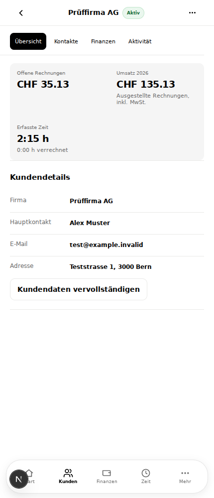
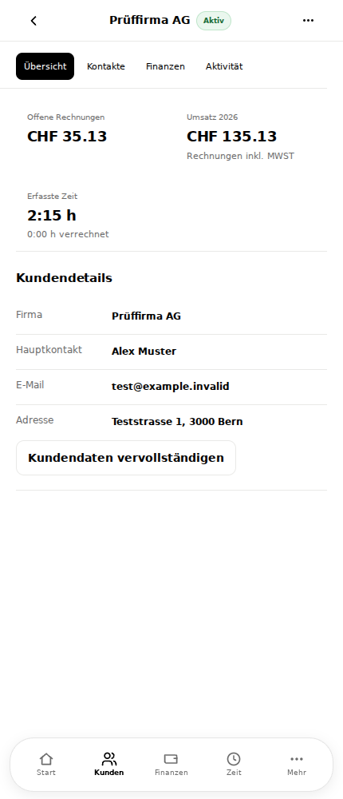
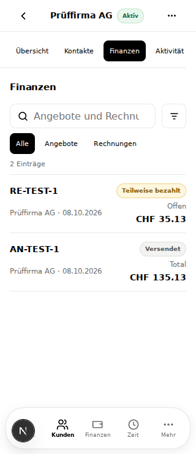
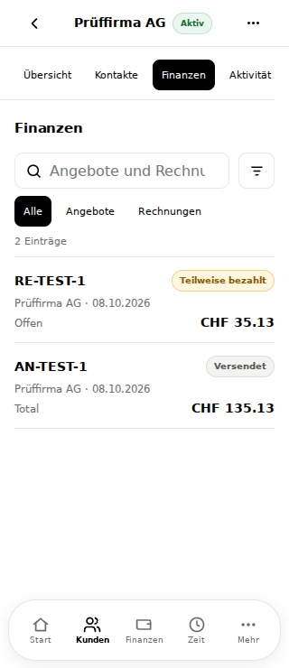
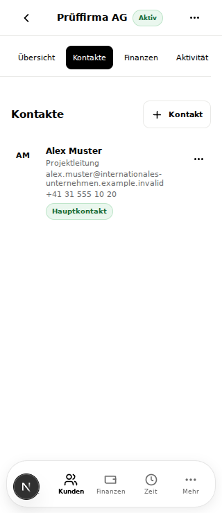
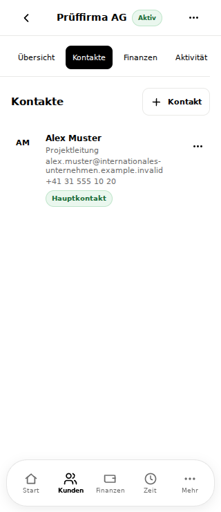
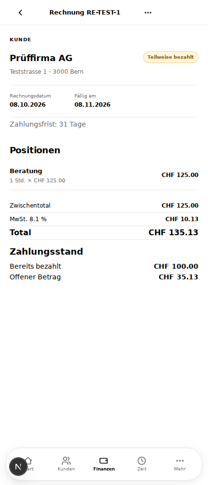
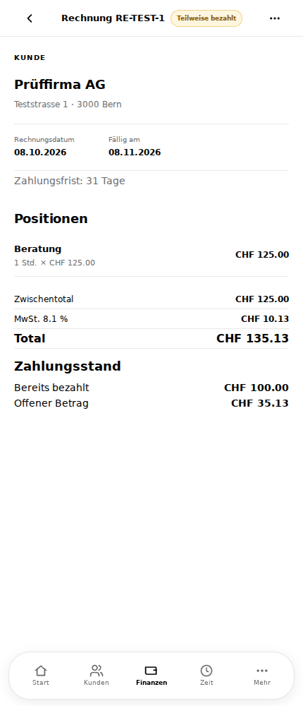
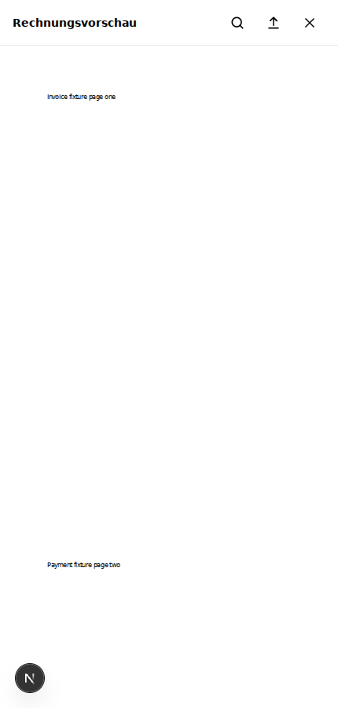
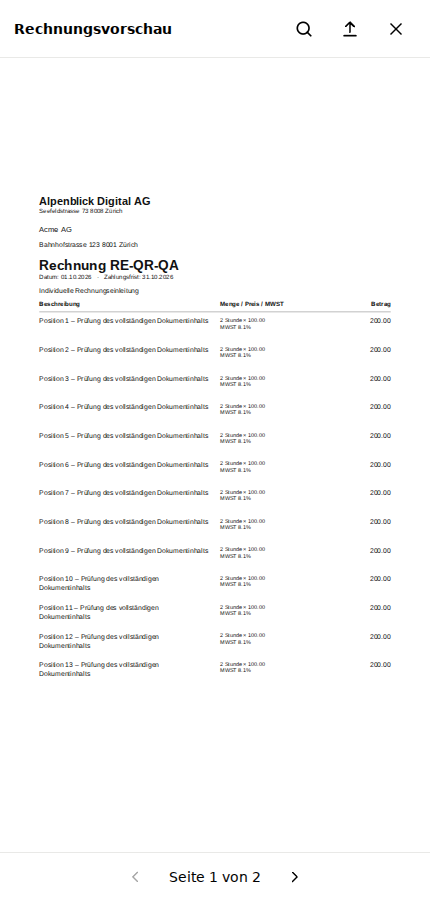

# BINSO ONE – Ursachen- und Migrationsbericht, 09.10.2026

Prüfbasis: aktuelles `main` **a6c07b233cd9dc71eeee0beacbb0fa1d8c67b79b**, einschliesslich der bereits integrierten zentralen UX-Korrekturen. Die sechs aktuellen Referenzen IMG_9835–IMG_9840 wurden mit dem tatsächlichen DOM verglichen. Keine Änderung an produktiven Daten, Finanzberechnungen, PDF-Erzeugung, Rollen oder der Bottom-Navigation.

## Nachweisverfahren und Grenzen

70 tatsächliche `app/**/page.tsx`-Dateien; 79 konkrete Routenvarianten einschliesslich aller Operator-Unterbereiche. `docs/architecture/ux-inventory.json` enthält Importabhängigkeiten, Verwendungsorte, JSX-Props, bedingte Zweige, Klassen, API-Präfixe, Layoutketten und sämtliche 2'563 CSS-Regeln mit Dateizeilen und Media-Kontext. Das ist ein statischer Erreichbarkeitsgraph; bedingte Formulare werden dadurch ausdrücklich nicht als immer sichtbar ausgegeben.

Die Browserbelege enthalten sichtbare DOM-Elemente, Klassen, Inline-Styles, Rechtecke, `getComputedStyle` und passende CSSOM-Regeln einschliesslich inaktiver Media Queries. Die berechneten Werte beweisen das Kaskadenergebnis. Frühere, überschreibbare Kandidaten bleiben im Beleg sichtbar. Wiederholte Selektoren sind nicht automatisch Fehler: 465 Wiederholungen wurden als Prüfkandidaten inventarisiert, nicht pauschal gelöscht. Kein `!important`.

Authentifizierte Ansichten wurden mit isolierten synthetischen HTTP-Daten geprüft; keine Produktionsschreibzugriffe. Datenbank/RLS und Geschäftsprozesse werden zusätzlich durch die vorhandenen Integrationstests geprüft. Browser-PWA und WebKit sind Emulation, keine physische iPhone-Installation. Druckdialoge und native Share-Sheets wurden nicht auf einem physischen Gerät abgenommen.

## Bestätigte Ursachen und zentrale Korrekturen

| ID / Route | Sichtbarer Fehler | Tatsächliche Komponente | Verantwortliche Struktur / Regel und Beweis | Ursache | Gemeinsam betroffen | Zentrale Korrektur | Auswirkungen | Regression |
| --- | --- | --- | --- | --- | --- | --- | --- | --- |
| F1 `/rechnungen/[id]`, `/angebote/[id]` | Menü nicht ganz rechts; Titel unnötig schmal | `DocumentPage → AppShell` | `.mobile-header-detail:has(.document-header-icons)` reservierte 124 px; DOM bei 430 px: Spalten `44 / 222.875 / 124` | `repeat(3,40px)` auch bei nur einem oder zwei Aktionen; weitere schmale Grid-Variante | Beide Dokumentdetails, Lesen/Bearbeiten | Aktionsbreite automatisch; rechts ausgerichtetes Flex-Layout; widersprüchliche schmale Grid-Vorgabe entfernt | Vorhandene PDF-/Menüaktionen bleiben; keine Navigation verändert | Detailheader, Status und Aktionsposition, 320–1440 px |
| F2 Finanzlisten, Kundenfinanzen, Startseite | Metadaten und Betrag teilen zweite Zeile; Beschriftung über Betrag statt links | `DocumentSummaryRow → ListRow` | `.document-summary-row>small` belegte nur Spalte 1; `.document-summary-amount` zweite Spalte als Grid. Bei 320 px: Betrag 114 px, Höhe 36 px | Gemeinsame Row-Grundlage entsprach noch dem alten Zweizeilenlayout | Rechnungen, Angebote, Dashboard- und Kunden-Dokumente | Metadaten volle zweite Zeile; Label/Betrag dritte volle Zeile als Flex; Umbruch langer Werte | Inhalte, Betragsquelle und Links unverändert; Zeilenhöhe folgt tatsächlichem Inhalt | Kundenfinanzen enthalten dieselben Row-Klassen; Overflow-Matrix und Screenshots |
| F3 `/kunden/[id]`, Dashboard, Finanzen | Grauer KPI-Block und grosse Zellen | `MetricTiles → Metric` | `.bo-metric-tiles` verwendete `--kpi-surface`; `.metric` Mindesthöhe 76, Padding 14; Beleg Kundengruppe 194.875 px hoch | Gemeinsame Komponente trug noch alte Fläche und Rhythmus | Alle `MetricTiles`-Verwendungen | Transparente Gruppe, Token-Abstände, keine künstliche Mindesthöhe, umbrechbare Beträge; Hinweistext gekürzt | Kennzahlenberechnung unverändert; keine zusätzliche erfundene vierte Kundenkennzahl | 2 Spalten mobil / 4 Desktop, Betrag und Overflow geprüft |
| F4 `/finanzen/analyse` | Analyse-KPIs anderer Aufbau mit Dekor-Icons | `FinancePage`, vier einzelne `Metric` | JSX verwendete eigene `metrics-grid` statt `MetricTiles` | Parallele Grundlayout-Verwendung trotz gleicher KPI-Verantwortung | Finanzanalyse im Vergleich zu Dashboard/Finanzen | Bestehende `MetricTiles` verwendet; Dekor-Icons entfernt | Analysewerte und Diagramme unverändert | Analyse in vollständiger Matrix und Screenshot |
| F5 `/kunden/[id]` Kontakte/Aktivität | Zusätzlicher Leerraum unter Tabs | `CustomerDetailPage`, `surface customer-tab-panel` | `surface` fügte vertikales Padding hinzu; `customer-tab-panel` setzte nur horizontales Padding zurück | Zwei Layoutverantwortlichkeiten am gleichen Container | Kontakt- und Aktivitätstab | Panel trägt nur seine vorhandene Panel-Klasse; Kontaktzeile selbst bleibt zentral | E-Mail/Telefon umbrechen, Menü rechts, Hauptkontakt-Checkbox und Aktionen bleiben | 320-px-Kontakte; Edit-/Archiv-/Hauptkontaktprozesse und kurze Form-Sheets |
| F6 Kunden, Mitarbeiter, Zeit, Finanzen | Tabs wurden mehrfach als rohe JSX-Container aufgebaut | `.tabs`-Div in vier Familien | Gleiche Klasse, separate Container; keine eigenständigen Layout-Props erforderlich | Gemeinsame Struktur nicht als Komponente verbindlich | Kunden-/Mitarbeiterdetails, Zeit, Finanz-/Dokumenttabs | Bestehender Stil über zentrale `DetailTabs`; Navigationslinks und ARIA-Tablist bleiben passend zum Verhalten | Keine gemeinsame Filterlogik erzwungen; fachliche Zustände bleiben lokal | Kunden-/Mitarbeiter-Tabs, Zeitgruppierung, Finanzfilter |
| F7 Dokumentvorschau | Endloses Dokument mit mehreren Seiten | `DocumentModal → PdfPreview` | `Array.from(pdf.numPages)` mountete jede Seite; Beleg: zwei 410×579-px-Blätter bei y70 und y665; Body `overflow:auto` | Renderer mountete ganze PDF-Datei und skalierte nur nach Breite | Rechnung, Angebot, Entwurf | `DocumentPageViewer`: genau ein gemountetes Blatt; PDF.js-Seitenzahl; Skalierung nach verfügbarer Breite **und Höhe**; feste interne Navigation; interner Zoom | Nur Darstellung verändert. Derselbe Blob wird geteilt/heruntergeladen; keine zweite Berechnung | A4-Verhältnis, erste/letzte Pfeile, alle Seiten, Zoom, 400-px-Höhe, Chromium/WebKit |
| F8 `/einstellungen/abonnement` Demo | Abo-Rechnung nutzte eigene HTML-Paper-Vorschau | `SubscriptionSettings`, Inline-Modal | Demo-Zweig rendert `<article className="paper invoice-paper">`; produktiver Stripe-Zweig war getrennt | Letzter tatsächlich verwendeter HTML-Rechnungsrenderer | Zwei vorhandene statische Demo-Aborechnungen | Gemeinsamer `DocumentModal`; echte statische PDFs aus unverändertem Serverrenderer | Produktive Stripe-Abrechnung unverändert; Demo-Text explizit Demo-Abonnement | September/Oktober: gemeinsamer Canvas, `Seite 1 von 1`, beide Pfeile deaktiviert |
| F9 `/agb` und Rechtsseiten | Gesamtseite horizontal breiter als Viewport | `LegalPage` | Browser: 426 px Dokumentbreite bei 390 px wegen langer Überschrift | Fehlender Umbruch im gemeinsamen Legal-Container | AGB, Datenschutz, Impressum, Auftrags-/Unterauftragsbearbeitung | `.legal-page {overflow-wrap:anywhere}` als zentrale Grundlage | Ausschliesslich Textumbruch | Alle Rechtsseiten in 320–1440-px-Matrix |
| F10 alte Vorschauvarianten | Test prüfte obsolete HTML-Rechnung statt PDF | `InvoicePreview`, `OfferPreview` | Import-/Verwendungssuche: nur Testreferenzen; Demo-Paper separat in F8 erkannt | Parallel erhaltene tote Renderer und dazugehörige CSS-Kaskade | Dokumenttests und alte Paper-/QR-Selektoren | Tests auf tatsächliches `documentPdf` umgestellt; tote Renderer und nachgewiesen ungenutzte Regeln entfernt | PDF-Erzeuger und QR-Bibliothek unverändert | PDF-Text/Seiten/Totale/Restbetrag/QR; `css:check`, Verwendungssuche |

## Verbindliche Komponentenfamilien

Es werden die geeigneten bestehenden Implementierungen weiterverwendet. Verantwortungsnamen sind keine Forderung nach zusätzlichen parallelen Wrappern.

| Verantwortung | Verbindliche Implementierung | Verwendung / Begründung |
| --- | --- | --- |
| AppPageLayout / DetailPageLayout / FormPageLayout | `AppShell`, `page-container`, Detail-/Form-Kontext-Props | Gleicher Header-/Scroll-/Inhaltsvertrag; Create/Edit aktivieren Formmodus. `OperatorShell` und öffentliche Marketingseiten haben fachlich getrennte Navigation. |
| AppHeader / DetailHeader | `AppShell` Mobile-Header, `PageHeading` / `DetailHeading` Desktop | Feste Mobile-Höhe; Back-/Status-/Actions-Props. Dokumentstatus einmal im Header über `documentPresentation`. |
| SearchFilterBar | `RecordsView` / `ListSearch`, vorhandene gemeinsame Toolbar-Tokens | Fachliche Zeit-/Finanzfilter unterscheiden sich, Suchfeldhöhe und Filterplatzierung nicht. |
| DetailTabs | `DetailTabs` in `binso-ux.tsx` | Gemeinsamer Container; `role=navigation` für Links, `role=tablist` für echte Tab-Buttons. |
| ResponsiveListRow | `ListRow`; `DocumentSummaryRow` für Finanzsemantik | Mobile ein gemeinsamer Row-Renderer; Desktop `RecordsView`-Tabelle als begründete responsive Variante. |
| StatusBadge | `Status` | Ton/Label fachlich abgeleitet; keine zusätzliche Dokumentbadge im Body. |
| CompactKpiGroup | `MetricTiles` / `Metric` | Gemeinsame Tokens, 2×2 mobile; drei vorhandene Kundenzahlen bleiben drei Werte. Operator-Monitoring hat fachliche Charts. |
| ActionBottomSheet / FormBottomSheet / FilterBottomSheet | `ActionSheet` / `FormSheet` / `FilterSheet` über `Sheet` | Gemeinsames Layer, Fokus, Header, Scroll-Body und FormActions-Footer. Bestehende AppShell-Navigationssheets bleiben geschützt. |
| Aktionszeile | vorhandene `SheetButton` / `SheetLink`, `Button` im `ActionsMenu`; gemeinsame `sheet-menu`- und `choice-list`-Tokens | Vorhandene geeignete Aktionskomponenten und gemeinsame Zeilenbasis; Auswahlzeilen behalten Beschreibung/Selektionsstatus. Lokale Callbacks und Berechtigungen bleiben erhalten. |
| FormField / FormActions | `Field`, `Input`, `Select`, `Textarea`, `FormActions` | Bereits zentrale Felder und Aktionsleisten. Spezialisierte Date-/Currency-Eingaben behalten Fachverhalten. |
| EmptyState | `EmptyState` | Vorhandene gemeinsame Implementierung. |
| DocumentPageViewer | `DocumentPageViewer` innerhalb `DocumentModal` | Ein Blatt; tatsächliche PDF-Seitenanzahl, ein Blob für Vorschau/Download. |

## PDF, QR, Download und Druck

`lib/server/document-pdf.ts` und `lib/qr-bill.ts` sind unverändert. PDFKit bleibt A4; `swissqrbill/pdf` erzeugt den Schweizer Zahlteil am unteren Blattrand und legt bei Platzmangel eine weitere A4-Seite an. Der Viewer navigiert die tatsächlich erzeugten Seiten und greift weder in Positionen noch Beträge, MWST, Referenzen oder PDF-Bytes ein.

Tests verwenden den produktiven Renderer und PDF.js-Text-/Seitenauswertung: Firmenangaben, Positionen, Datum, CHF 216.20 Total, CHF 116.20 Restbetrag, strukturierter Schuldner, gültige SCOR-/ungültige Referenzen, keine offene Zahlungsaufforderung bei bezahlt/storniert/Entwurf, Angebot ohne QR sowie Mehrseitenrechnung mit QR auf der letzten Seite. Relevante normative Quelle: [SIX QR-Rechnung](https://www.six-group.com/en/products-services/banking-services/payment-standardization/standards/qr-bill.html) und [Implementation Guidelines 2.4](https://www.six-group.com/dam/download/banking-services/standardization/qr-bill/ig-qr-bill-v2.4-en.pdf). Es wird keine externe Bank-/SIX-Zertifizierung behauptet.

Download-Fallback nimmt exakt den geladenen Blob. Native Share-Funktion bleibt bestehen. Druck verwendet das tatsächliche heruntergeladene PDF; die Bildschirm-Fit-Skalierung verändert keine Druckmasse. Ein physischer Druck wurde nicht durchgeführt. Optionales Touch-Swiping wurde nicht implementiert; Pfeilnavigation ist verbindlich vorhanden.

## Scrollen und unveränderte Navigation

Normale App-Seiten scrollen vertikal mit sichtbarem Mobile-Header. Chat behält Header und Composer, nur Nachrichten scrollen. Formularsheets haben fixen Header/Footer und einen scrollenden Body, einschliesslich 320×400-Viewport. PDF hat festen Header und Navigation, nur der Dokumentbereich zoomt/scrollt. Gesamtseiten-Overflow wird pro Route gemessen.

`components/app-shell.tsx` wurde nicht geändert. `navigation-contract-test.mjs` verifiziert den freigegebenen Markup-/CSS-Digest **aa85bddbeda0c9cb3349f3592857675a6cab219ac95f462eee250927bad8dfd1** (vollständiger Digest im Test). Zusätzlich sind drei 406×69-px-Navigationsclips pixelgleich ausserhalb des dokumentierten Next.js-Development-Indikators im Ausgangsbeleg (x0–66/y16–69). Der Overlay-Bereich ist ausdrücklich kein Navigationsänderungsnachweis. Geschützte Navigation wird nicht durch neue Wrapper ersetzt.

## FAST / INTEGRATION / RELEASE und CI-Befund

FAST: geänderte Dateien linten, relevante Tests, lokale Komponenten-Vorschau. INTEGRATION: Typecheck/Build und betroffene Regressionen pro Arbeitspaket. RELEASE: alle vorhandenen Sicherheits-, Integrations-, Browser-, Responsive- und PWA-Gates; kein Gate deaktiviert.

Bestehende Quality-Pipeline hat bereits pnpm-Lockfile-Cache, Next-Compiler-Cache, zwei Chromium-Routenshards, separate Browser-Engines und einmaligen Build mit exaktem ZIP, das nach Quality an Azure weitergereicht wird. Browserjobs bauen nicht erneut. Daher keine erneute Pipeline-Architektur eingeführt. Browserinstallation ist je Engine begrenzt; `--with-deps` bleibt für reproduzierbare CI. Ein Browser-Binary-Cache ohne nachgewiesenen Gewinn wurde nicht hinzugefügt. Runtime-Smoke wurde auf expliziten Loopback-Host gesetzt, damit die lokale Host-Erkennung keine funktionierenden Builds blockiert.

## Teststatus

Lokale Unit-/Geschäftsprozess-Suiten, Lint, Typecheck, Build, CSS-Architektur, Release-/Dokumentations-/Repository-Gates und exakter ZIP-Start: bestanden. Chromium: **1’106** Fälle (79 Routen × 7 Breiten × 2 Themes), WebKit: **140** Fälle, echte erzeugte PDF-Datei: **12** zusätzliche Fälle mit bytegleichem Download, Vergleichsaufnahmen: **3** Fälle. Alle neun Funktionsgruppen bestanden. PWA-Neustart/Offline/Manifest und keine API-Daten im Service-Worker-Cache bestanden. Keine kritischen/schweren Axe-Befunde in den geprüften Breiten. Produktionsaudit ohne bekannte Schwachstellen; vollständiges Audit akzeptiert ausschliesslich die bereits dokumentierte temporäre Dev-Tool-Ausnahme GHSA-VFJ7-8CJW-P6XM. [Maschinenlesbare Ergebnisse](assets/ux-20261009/local-release-results.json).

GitHub-Quality und Azure-Deployment sind beim Schreiben dieses Commits noch ausstehend. Die Abnahme der Live-Version wird anschliessend anhand des tatsächlich ausgelieferten SHA dokumentiert; lokale Belege werden nicht als Produktionsprüfung ausgegeben.

## Vollständige Routen-Migrationstabelle

Ist-Komponenten beziehen sich auf den aktuellen Ausgangscommit, nicht auf einen älteren Screenshotstand. `—` bedeutet: kein bestätigter Konflikt in dieser Route; keine spekulative Migration. Die vollständigen erreichbaren Komponenten/Props stehen im maschinenlesbaren Inventar. Öffentliche Auth-, Redirect- und Marketingseiten müssen kein AppShell-Layout mit Bottom-Navigation erhalten.

| Route | Ist-Komponente | Soll-Komponente | CSS-Konflikt | Ursache | Korrektur | Teststatus |
| --- | --- | --- | --- | --- | --- | --- |
| /agb | LegalPage → MarketingHeader | LegalPage | F9 | Siehe Befunde F9 | Zentrale Korrektur F9 | Chromium 7 Breiten × 2 Themes: bestanden |
| /angebote/[id] | OfferEditor → DocumentPage | AppShell, FormSheet, FormActions, DocumentPageViewer | F1, F7, F10 | Siehe Befunde F1, F7, F10 | Zentrale Korrektur F1, F7, F10 | Chromium 7 Breiten × 2 Themes: bestanden |
| /angebote/neu | OfferEditor → DocumentPage | AppShell, FormSheet, FormActions, DocumentPageViewer | F1, F7, F10 | Siehe Befunde F1, F7, F10 | Zentrale Korrektur F1, F7, F10 | Chromium 7 Breiten × 2 Themes: bestanden |
| /angebote | OffersPage → FinancialDocumentsPage | AppShell, DetailTabs, ListRow | F2, F6 | Siehe Befunde F2, F6 | Zentrale Korrektur F2, F6 | Chromium 7 Breiten × 2 Themes: bestanden |
| /auftragsbearbeitung | LegalPage → MarketingHeader | LegalPage | F9 | Siehe Befunde F9 | Zentrale Korrektur F9 | Chromium 7 Breiten × 2 Themes: bestanden |
| /belege | DocumentsHubPage → FinancePage | AppShell, DetailTabs, ListRow, MetricTiles | F2, F3 | Siehe Befunde F2, F3 | Zentrale Korrektur F2, F3 | Chromium 7 Breiten × 2 Themes: bestanden |
| /benachrichtigungen | NotificationsPage → NotificationRecord | AppShell | — | Kein bestätigter Widerspruch | Bestehende Grundlage beibehalten | Chromium 7 Breiten × 2 Themes: bestanden |
| /dashboard | DashboardPage → AppShell | AppShell, ListRow, MetricTiles | F2, F3 | Siehe Befunde F2, F3 | Zentrale Korrektur F2, F3 | Chromium 7 Breiten × 2 Themes: bestanden |
| /datenschutz | LegalPage → MarketingHeader | LegalPage | F9 | Siehe Befunde F9 | Zentrale Korrektur F9 | Chromium 7 Breiten × 2 Themes: bestanden |
| /demo | Logo | Logo | — | Kein bestätigter Widerspruch | Bestehende Grundlage beibehalten | Chromium 7 Breiten × 2 Themes: bestanden |
| /einladung | Logo → Button | Logo → Button | — | Kein bestätigter Widerspruch | Bestehende Grundlage beibehalten | Chromium 7 Breiten × 2 Themes: bestanden |
| /einstellungen/abonnement | SubscriptionSettingsPage → AppShell | AppShell, FormSheet, DocumentPageViewer | F7, F8 | Siehe Befunde F7, F8 | Zentrale Korrektur F7, F8 | Chromium 7 Breiten × 2 Themes: bestanden |
| /einstellungen/benachrichtigungen | NotificationSettingsPage → AppShell | AppShell | — | Kein bestätigter Widerspruch | Bestehende Grundlage beibehalten | Chromium 7 Breiten × 2 Themes: bestanden |
| /einstellungen/darstellung | AppearanceSettingsPage → AppShell | AppShell | — | Kein bestätigter Widerspruch | Bestehende Grundlage beibehalten | Chromium 7 Breiten × 2 Themes: bestanden |
| /einstellungen/datenschutz | PrivacySettingsPage → loadPreferences | AppShell | — | Kein bestätigter Widerspruch | Bestehende Grundlage beibehalten | Chromium 7 Breiten × 2 Themes: bestanden |
| /einstellungen/dokumente | DocumentSettingsPage → AppShell | AppShell, FormActions | — | Kein bestätigter Widerspruch | Bestehende Grundlage beibehalten | Chromium 7 Breiten × 2 Themes: bestanden |
| /einstellungen/firma | CompanySettingsPage → AppShell | AppShell, FormActions | — | Kein bestätigter Widerspruch | Bestehende Grundlage beibehalten | Chromium 7 Breiten × 2 Themes: bestanden |
| /einstellungen/konto | AccountSettingsPage → AppShell | AppShell, FormActions | — | Kein bestätigter Widerspruch | Bestehende Grundlage beibehalten | Chromium 7 Breiten × 2 Themes: bestanden |
| /einstellungen | SettingsPage → AppShell | AppShell | — | Kein bestätigter Widerspruch | Bestehende Grundlage beibehalten | Chromium 7 Breiten × 2 Themes: bestanden |
| /einstellungen/sicherheit | SecuritySettingsPage → MfaState | AppShell | — | Kein bestätigter Widerspruch | Bestehende Grundlage beibehalten | Chromium 7 Breiten × 2 Themes: bestanden |
| /einstellungen/sprache | LanguageSettingsPage → AppShell | AppShell | — | Kein bestätigter Widerspruch | Bestehende Grundlage beibehalten | Chromium 7 Breiten × 2 Themes: bestanden |
| /einstellungen/team | TeamSettingsPage → TeamPayload | AppShell, FormSheet | — | Kein bestätigter Widerspruch | Bestehende Grundlage beibehalten | Chromium 7 Breiten × 2 Themes: bestanden |
| /einstellungen/zeiterfassung | TimeSettingsPage → AppShell | AppShell, FormActions | — | Kein bestätigter Widerspruch | Bestehende Grundlage beibehalten | Chromium 7 Breiten × 2 Themes: bestanden |
| /email-bestaetigen | Logo → Button | Logo → Button | — | Kein bestätigter Widerspruch | Bestehende Grundlage beibehalten | Chromium 7 Breiten × 2 Themes: bestanden |
| /finanzen/analyse | FinanceAnalysisPage → AppShell | AppShell, MetricTiles | F3, F4 | Siehe Befunde F3, F4 | Zentrale Korrektur F3, F4 | Chromium 7 Breiten × 2 Themes: bestanden |
| /finanzen | FinancePage → FinancialSummary | AppShell, DetailTabs, ListRow, MetricTiles | F2, F3, F6 | Siehe Befunde F2, F3, F6 | Zentrale Korrektur F2, F3, F6 | Chromium 7 Breiten × 2 Themes: bestanden |
| /impressum | LegalPage → MarketingHeader | LegalPage | F9 | Siehe Befunde F9 | Zentrale Korrektur F9 | Chromium 7 Breiten × 2 Themes: bestanden |
| /kunden/[id]/bearbeiten | CustomerForm → AppShell | AppShell, FormActions | — | Kein bestätigter Widerspruch | Bestehende Grundlage beibehalten | Chromium 7 Breiten × 2 Themes: bestanden |
| /kunden/[id] | CustomerDetail → FinancialSummary | AppShell, DetailTabs, ListRow, MetricTiles, FormSheet | F2, F3, F5, F6 | Siehe Befunde F2, F3, F5, F6 | Zentrale Korrektur F2, F3, F5, F6 | Chromium 7 Breiten × 2 Themes: bestanden |
| /kunden/neu | CustomerForm → AppShell | AppShell, FormActions | — | Kein bestätigter Widerspruch | Bestehende Grundlage beibehalten | Chromium 7 Breiten × 2 Themes: bestanden |
| /kunden | CustomersPage → useDemoRows | AppShell, ListRow | — | Kein bestätigter Widerspruch | Bestehende Grundlage beibehalten | Chromium 7 Breiten × 2 Themes: bestanden |
| /login | Logo → Button | Logo → Button | — | Kein bestätigter Widerspruch | Bestehende Grundlage beibehalten | Chromium 7 Breiten × 2 Themes: bestanden |
| /mitarbeiter/[id] | EmployeeForm → AppShell | AppShell, DetailTabs, FormActions | F6 | Siehe Befunde F6 | Zentrale Korrektur F6 | Chromium 7 Breiten × 2 Themes: bestanden |
| /mitarbeiter/neu | EmployeeForm → AppShell | AppShell, DetailTabs, FormActions | — | Kein bestätigter Widerspruch | Bestehende Grundlage beibehalten | Chromium 7 Breiten × 2 Themes: bestanden |
| /mitarbeiter | EmployeesPage → useDemoRows | AppShell, ListRow | — | Kein bestätigter Widerspruch | Bestehende Grundlage beibehalten | Chromium 7 Breiten × 2 Themes: bestanden |
| /offline | Logo | Logo | — | Kein bestätigter Widerspruch | Bestehende Grundlage beibehalten | Chromium 7 Breiten × 2 Themes: bestanden |
| /operator/[...section] | OperatorPage → operatorNav | OperatorPage → operatorNav | — | Kein bestätigter Widerspruch | Bestehende Grundlage beibehalten | Chromium 7 Breiten × 2 Themes: bestanden |
| /operator/login | Logo → Button | Logo → Button | — | Kein bestätigter Widerspruch | Bestehende Grundlage beibehalten | Chromium 7 Breiten × 2 Themes: bestanden |
| /operator | OperatorPage → operatorNav | OperatorPage → operatorNav | — | Kein bestätigter Widerspruch | Bestehende Grundlage beibehalten | Chromium 7 Breiten × 2 Themes: bestanden |
| / | MarketingHeader → Logo | MarketingHeader → Logo | — | Kein bestätigter Widerspruch | Bestehende Grundlage beibehalten | Chromium 7 Breiten × 2 Themes: bestanden |
| /passwort-vergessen | Logo → Button | Logo → Button | — | Kein bestätigter Widerspruch | Bestehende Grundlage beibehalten | Chromium 7 Breiten × 2 Themes: bestanden |
| /passwort-zuruecksetzen | Logo → Button | Logo → Button | — | Kein bestätigter Widerspruch | Bestehende Grundlage beibehalten | Chromium 7 Breiten × 2 Themes: bestanden |
| /portal/login | DashboardPage | DashboardPage | — | Kein bestätigter Widerspruch | Bestehende Grundlage beibehalten | Chromium 7 Breiten × 2 Themes: bestanden |
| /portal | DashboardPage | DashboardPage | — | Kein bestätigter Widerspruch | Bestehende Grundlage beibehalten | Chromium 7 Breiten × 2 Themes: bestanden |
| /portal/registrieren | CreatePage | CreatePage | — | Kein bestätigter Widerspruch | Bestehende Grundlage beibehalten | Chromium 7 Breiten × 2 Themes: bestanden |
| /preise | MarketingHeader → Logo | MarketingHeader → Logo | — | Kein bestätigter Widerspruch | Bestehende Grundlage beibehalten | Chromium 7 Breiten × 2 Themes: bestanden |
| /preview/dashboard | DashboardPage → AppShell | AppShell, ListRow, MetricTiles | F2, F3 | Siehe Befunde F2, F3 | Zentrale Korrektur F2, F3 | Chromium 7 Breiten × 2 Themes: bestanden |
| /preview/rechnungen | InvoicesPage → FinancialDocumentsPage | AppShell, DetailTabs, ListRow | F2 | Siehe Befunde F2 | Zentrale Korrektur F2 | Chromium 7 Breiten × 2 Themes: bestanden |
| /preview/zeit | TimePage → formatMinutes | AppShell, DetailTabs, FormSheet | — | Kein bestätigter Widerspruch | Bestehende Grundlage beibehalten | Chromium 7 Breiten × 2 Themes: bestanden |
| /produkt | MarketingHeader → Logo | MarketingHeader → Logo | — | Kein bestätigter Widerspruch | Bestehende Grundlage beibehalten | Chromium 7 Breiten × 2 Themes: bestanden |
| /produkte/[id] | ProductForm → AppShell | AppShell, FormActions | — | Kein bestätigter Widerspruch | Bestehende Grundlage beibehalten | Chromium 7 Breiten × 2 Themes: bestanden |
| /produkte/neu | ProductForm → AppShell | AppShell, FormActions | — | Kein bestätigter Widerspruch | Bestehende Grundlage beibehalten | Chromium 7 Breiten × 2 Themes: bestanden |
| /produkte | ProductsPage → useDemoRows | AppShell, ListRow | — | Kein bestätigter Widerspruch | Bestehende Grundlage beibehalten | Chromium 7 Breiten × 2 Themes: bestanden |
| /projekte/neu | ProjectForm → AppShell | AppShell, FormActions | — | Kein bestätigter Widerspruch | Bestehende Grundlage beibehalten | Chromium 7 Breiten × 2 Themes: bestanden |
| /rechnungen/[id] | InvoiceEditor → DocumentPage | AppShell, FormSheet, FormActions, DocumentPageViewer | F1, F7, F10 | Siehe Befunde F1, F7, F10 | Zentrale Korrektur F1, F7, F10 | Chromium 7 Breiten × 2 Themes: bestanden |
| /rechnungen/neu | InvoiceEditor → DocumentPage | AppShell, FormSheet, FormActions, DocumentPageViewer | F1, F7, F10 | Siehe Befunde F1, F7, F10 | Zentrale Korrektur F1, F7, F10 | Chromium 7 Breiten × 2 Themes: bestanden |
| /rechnungen | InvoicesPage → FinancialDocumentsPage | AppShell, DetailTabs, ListRow | F2, F6 | Siehe Befunde F2, F6 | Zentrale Korrektur F2, F6 | Chromium 7 Breiten × 2 Themes: bestanden |
| /registrieren | Logo → Button | Logo → Button | — | Kein bestätigter Widerspruch | Bestehende Grundlage beibehalten | Chromium 7 Breiten × 2 Themes: bestanden |
| /spesen/[id] | ExpenseForm → AppShell | AppShell, FormSheet, FormActions | — | Kein bestätigter Widerspruch | Bestehende Grundlage beibehalten | Chromium 7 Breiten × 2 Themes: bestanden |
| /spesen/neu | ExpenseForm → AppShell | AppShell, FormSheet, FormActions | — | Kein bestätigter Widerspruch | Bestehende Grundlage beibehalten | Chromium 7 Breiten × 2 Themes: bestanden |
| /spesen | ExpensesPage → useDemoRows | AppShell, ListRow | — | Kein bestätigter Widerspruch | Bestehende Grundlage beibehalten | Chromium 7 Breiten × 2 Themes: bestanden |
| /support/[id] | SupportChat → useWorkspaceViewport | AppShell | — | Kein bestätigter Widerspruch | Bestehende Grundlage beibehalten | Chromium 7 Breiten × 2 Themes: bestanden |
| /support/neu | SupportTicketForm → AppShell | AppShell, FormActions | — | Kein bestätigter Widerspruch | Bestehende Grundlage beibehalten | Chromium 7 Breiten × 2 Themes: bestanden |
| /support | SupportPage → useSupportRows | AppShell, ListRow, MetricTiles | F3 | Siehe Befunde F3 | Zentrale Korrektur F3 | Chromium 7 Breiten × 2 Themes: bestanden |
| /unterauftragsbearbeiter | LegalPage → MarketingHeader | LegalPage | F9 | Siehe Befunde F9 | Zentrale Korrektur F9 | Chromium 7 Breiten × 2 Themes: bestanden |
| /willkommen | DashboardPage | DashboardPage | — | Kein bestätigter Widerspruch | Bestehende Grundlage beibehalten | Chromium 7 Breiten × 2 Themes: bestanden |
| /zahlungen/[id] | PaymentDetail → AppShell | AppShell | — | Kein bestätigter Widerspruch | Bestehende Grundlage beibehalten | Chromium 7 Breiten × 2 Themes: bestanden |
| /zahlungen/neu | PaymentForm → AppShell | AppShell, FormActions | — | Kein bestätigter Widerspruch | Bestehende Grundlage beibehalten | Chromium 7 Breiten × 2 Themes: bestanden |
| /zahlungen | PaymentsPage → useDemoRows | AppShell, DetailTabs, ListRow | — | Kein bestätigter Widerspruch | Bestehende Grundlage beibehalten | Chromium 7 Breiten × 2 Themes: bestanden |
| /zeit | TimePage → formatMinutes | AppShell, DetailTabs, FormSheet | F6 | Siehe Befunde F6 | Zentrale Korrektur F6 | Chromium 7 Breiten × 2 Themes: bestanden |

## Vorher-/Nachher-Belege

Alle Bilder enthalten synthetische Daten. PDFs stammen aus dem unveränderten produktiven Renderer. Zu jedem Bild liegt die gleichnamige DOM-/CSSOM-JSON-Datei.

| Ansicht | Vorher | Nachher |
| --- | --- | --- |
| customer-overview |  |  |
| customer-finances |  |  |
| contacts |  |  |
| invoice-header |  |  |
| pdf |  |  |

[QR-Seite 2](assets/ux-20261009/after-pdf-qr.png) · [Navigationsvergleich mit dokumentierter Overlay-Ausnahme](assets/ux-20261009/navigation-pixel-comparison.json)

## Aufgelöste Operator-Unterseiten

Alle benutzen `app/operator/[...section]/page.tsx → OperatorPage → OperatorShell`. Die fachlichen Bereiche behalten ihre vorhandenen Tabellen/Diagramme. Kein bestätigter neuer CSS-Konflikt; vollständige Chromium-Matrix bestanden.

| Route | Ist-Komponente | Soll-Komponente | CSS-Konflikt | Ursache | Korrektur | Teststatus |
| --- | --- | --- | --- | --- | --- | --- |
| /operator/kunden | OperatorPage / OperatorShell | Bestehende Operator-Grundlage | — | Kein bestätigter Widerspruch | Beibehalten | 7 Breiten × 2 Themes bestanden |
| /operator/tickets | OperatorPage / OperatorShell | Bestehende Operator-Grundlage | — | Kein bestätigter Widerspruch | Beibehalten | 7 Breiten × 2 Themes bestanden |
| /operator/monitoring | OperatorPage / OperatorShell | Bestehende Operator-Grundlage | — | Kein bestätigter Widerspruch | Beibehalten | 7 Breiten × 2 Themes bestanden |
| /operator/zahlungen | OperatorPage / OperatorShell | Bestehende Operator-Grundlage | — | Kein bestätigter Widerspruch | Beibehalten | 7 Breiten × 2 Themes bestanden |
| /operator/sicherheit | OperatorPage / OperatorShell | Bestehende Operator-Grundlage | — | Kein bestätigter Widerspruch | Beibehalten | 7 Breiten × 2 Themes bestanden |
| /operator/audit | OperatorPage / OperatorShell | Bestehende Operator-Grundlage | — | Kein bestätigter Widerspruch | Beibehalten | 7 Breiten × 2 Themes bestanden |
| /operator/finanzen | OperatorPage / OperatorShell | Bestehende Operator-Grundlage | — | Kein bestätigter Widerspruch | Beibehalten | 7 Breiten × 2 Themes bestanden |
| /operator/abonnemente | OperatorPage / OperatorShell | Bestehende Operator-Grundlage | — | Kein bestätigter Widerspruch | Beibehalten | 7 Breiten × 2 Themes bestanden |
| /operator/sperrungen | OperatorPage / OperatorShell | Bestehende Operator-Grundlage | — | Kein bestätigter Widerspruch | Beibehalten | 7 Breiten × 2 Themes bestanden |
| /operator/ankuendigungen | OperatorPage / OperatorShell | Bestehende Operator-Grundlage | — | Kein bestätigter Widerspruch | Beibehalten | 7 Breiten × 2 Themes bestanden |

## Release-Nachprüfung

Der erste GitHub-Browserlauf fand einen Fehler in der zusätzlichen Testassertion: Die Betragsprüfung wartete auch bei generischen Kunden-/Mitarbeiterzeilen ohne Betrag auf `.document-summary-amount`. Sie prüft jetzt ausschliesslich die ausdrücklich mit `has-value` gekennzeichneten Zeilen. Routen-/Overflow-/Header-/A11y-/Funktionsprüfungen bleiben unverändert verpflichtend. Dieser Befund betrifft den Test, keine produktive Layoutkorrektur.
